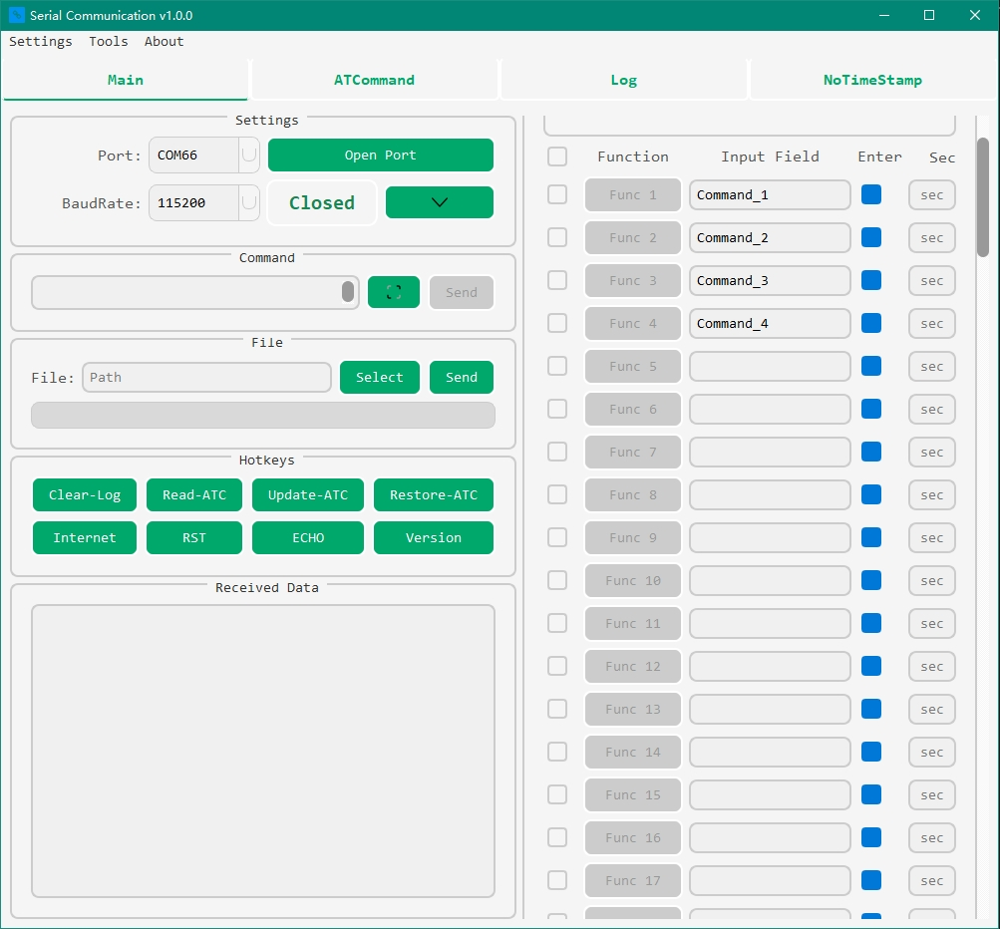

<div align="center">
  <h1>SCOM</h1>
  <p><i>一款适合你的开源串口通信工具</i></p>

  
  
  

</div>
<p align="center">
  <a href="#一简介">简介</a> •
  <a href="#二系统要求">系统要求</a> •
  <a href="#三安装步骤">安装</a> •
  <a href="#四目录结构及文件说明">目录结构</a> •
  <a href="#五快速开始">快速开始</a> •
  <a href="#六功能特性">功能特性</a> •
  <a href="#七操作手册">操作手册</a> •
  <a href="#八自定义与扩展">自定义与扩展</a> •
  <a href="#九贡献指南">贡献指南</a>
</p>

---

**🌐 Language / 语言**

- [中文文档](./README.md)
- [English Documentation](./README_EN.md)

---

## 一、简介



**SCOM - Serial Communication:**

SCOM 是一个功能强大且易于扩展的开源串口通信工具，专为需要与串口设备进行交互的开发者、测试工程师和硬件爱好者设计。

### 🚀 项目特点

- **简单易用**：直观的图形界面，上手即用
- **功能丰富**：支持多种数据格式、自定义指令、批量操作等
- **高度可扩展**：模块化架构，支持二次开发和功能定制
- **完整日志**：详细的通信日志记录和分析功能
- **主题支持**：多种UI主题，支持个性化定制

无论您是嵌入式开发工程师、IoT设备调试人员，还是学习串口通信的初学者，SCOM 都能为您提供便捷高效的串口通信解决方案。

## 二、系统要求

- **操作系统**：Windows 10/11
- **Python 版本**：Python 3.6.1 及以上（推荐使用 Python 3.8+）
- **依赖库**：
  1. **PySide6**：用于构建用户界面
  2. **pyserial**：实现串口通信功能  
  3. **requests**：用于网络请求和更新检查
  4. **markdown**：用于帮助文档渲染
  5. **python-dotenv**：用于环境变量管理

## 三、安装步骤

### 方法一：一键安装（推荐）
1. 下载项目到本地
2. 以管理员权限运行 `run as admin.bat`，脚本将自动：
   - 检查并安装 Python 环境
   - 安装所需依赖库
   - 配置运行环境

### 方法二：手动安装
1. **安装 Python**：
   - 从 [Python 官方网站](https://www.python.org/downloads/) 下载 Python 3.8+ 版本
   - 安装时勾选"Add Python to PATH"选项

2. **获取源代码**：
   ```bash
   git clone https://github.com/ifishin/SCOM.git
   cd SCOM
   ```

3. **安装依赖**：
   ```bash
   pip install -r requirements.txt
   ```
   或者单独安装：
   ```bash
   pip install pyside6 pyserial requests markdown python-dotenv
   ```

4. **构建项目**（可选）：
   ```bash
   python setup.py build
   ```

## 四、目录结构及文件说明

以下是 SCOM 的目录结构：

```plaintext
SCOM/
│
├── components/
│   └── [components_modules_here]
├── config/
│   └── [config_files_here]
├── docs/
│   └── [documentation_files_here]
├── examples/
│   └── [example_files_here]
├── logs/
│   └── [application_logs_here]
├── middleware/
│   └── [middleware_modules_here]
├── res/
│   └── [resource_files_here]
├── scripts/
│   └── [debug_script_files_here]
├── styles/
│   └── [style_files_here]
├── tests/
│   └── [test_scripts_here]
├── tmps/
│   └── [temporary_files_here]
├── utils/
│   └── [utility_modules_here]
├── .env
├── .gitignore
├── CHANGELOG.md
├── config.ini
├── favicon.ico
├── KNOWN_ISSUES.md
├── LICENSE
├── README.md
├── requirements.txt
├── ROADMAP.md
├── run as admin.bat
├── SCOM.spec
├── setup.py
└── Window.py
```

- **components**：包含项目的组件模块，用于实现不同的功能，如串口通信组件等。
- **config**：存放项目的配置文件，用于存储一些常用的设置，如串口参数配置。
- **docs**：包含项目的文档文件，如用户手册、API 文档等。
- **examples**：存放示例文件，用于演示如何使用 SCOM 进行串口通信。
- **logs**：存放工具的错误日志文件，方便后续分析和故障排查。
- **middleware**：包含中间件模块，用于处理数据流或其他中间处理逻辑，如数据过滤或协议转换。
- **res**：包含项目的资源文件，如图标、图片等。
- **scripts**：存放调试脚本文件，用于开发和测试过程中的辅助工具。
- **styles**：用于存储与界面样式相关的文件，如 CSS 或样式表。
- **tests**：包含测试脚本，用于验证项目的功能和性能。
- **tmps**：临时文件目录，用于存储临时数据或在运行过程中生成的中间文件。
- **utils**：包含一些实用工具函数或模块，如数据转换工具。
- **.env**：环境配置文件，用于存储敏感信息或环境变量。
- **.gitignore**：Git 忽略文件，用于指定哪些文件不应被版本控制。
- **CHANGELOG.md**：变更日志文件，记录项目的版本更新和修改历史。
- **config.ini**：配置文件，存储一些常用的设置，如默认串口参数。
- **favicon.ico**：网站图标文件，用于浏览器标签页显示。
- **KNOWN_ISSUES.md**：已知问题文件，列出当前版本的已知缺陷和解决方案。
- **LICENSE**：许可证文件，定义项目的开源许可证条款。
- **README.md**：项目说明文件，提供项目的概述、安装和使用指南。
- **requirements.txt**：依赖文件，列出项目所需的 Python 包及其版本。
- **ROADMAP.md**：路线图文件，描述项目的未来开发计划和目标。
- **run as admin.bat**：Windows 下的批处理文件，用于以管理员权限运行程序，可以检查环境并安装所需的组件。
- **SCOM.spec**：PyInstaller 规格文件，用于生成可执行文件的配置。
- **setup.py**：用于项目的安装和打包脚本，支持通过 pip 安装。
- **Window.py**：主程序文件，包含应用程序的主窗口和核心逻辑。

## 五、快速开始

### 启动应用
```bash
# 进入项目目录
cd SCOM

# 启动应用
python Window.py
```

### 基本使用流程
1. **连接串口设备**：启动应用后，从顶部下拉菜单选择串口和波特率
2. **发送数据**：在输入框中输入要发送的数据，点击发送按钮
3. **接收数据**：串口接收到的数据会实时显示在主界面
4. **保存日志**：所有通信数据会自动保存到 `logs/` 目录

## 六、功能特性

- ✅ **实时串口通信**：支持多种波特率和数据格式
- ✅ **数据格式支持**：ASCII、HEX 发送接收
- ✅ **自定义指令**：可配置常用指令快捷按钮
- ✅ **数据日志记录**：完整的通信日志记录和查看
- ✅ **主题样式**：多种UI主题可选，支持自定义样式
- ✅ **批量操作**：支持指令批量执行
- ✅ **智能解析**：自动识别指令和时间戳格式
- ✅ **环境配置**：一键环境配置和依赖安装
- ✅ **扩展性强**：模块化设计，易于二次开发

## 七、操作手册

- **帮助文档**：SCOM 提供了详细的操作手册，您可以在 [Help.md](./docs/Help.md) 中找到关于如何使用 SCOM 的详细说明。
- **样式管理**：查看 [样式管理指南](./docs/STYLE_MANAGEMENT_GUIDE.md) 了解如何自定义界面主题。
- **已知问题**：遇到问题时请先查阅 [KNOWN_ISSUES.md](./KNOWN_ISSUES.md)。

## 八、自定义与扩展

### 二次开发

SCOM 采用模块化设计，您可以轻松扩展功能：

1. **添加自定义组件**：在 `components/` 目录下添加新的功能模块
2. **自定义样式**：修改 `styles/` 目录下的 QSS 样式文件
3. **扩展协议支持**：在 `middleware/` 目录下添加协议解析器
4. **添加工具脚本**：在 `scripts/` 目录下添加辅助工具

### 开发环境配置

```bash
# 克隆项目
git clone https://github.com/ifishin/SCOM.git
cd SCOM

# 安装开发依赖
pip install -r requirements.txt

# 运行测试
python -m pytest tests/

# 启动开发模式
python Window.py
```

## 九、贡献指南

我们欢迎任何形式的贡献！

### 如何贡献

1. **Fork** 本仓库
2. **创建**功能分支：`git checkout -b feature/AmazingFeature`
3. **提交**更改：`git commit -m 'Add some AmazingFeature'`
4. **推送**到分支：`git push origin feature/AmazingFeature`
5. **创建** Pull Request

### 贡献类型

- 🐛 **Bug 修复**：修复已知问题
- ✨ **新功能**：添加新的功能特性
- 📝 **文档**：改进文档和注释
- 🎨 **样式**：UI/UX 改进和样式优化
- ⚡ **性能**：性能优化和代码重构
- ✅ **测试**：添加测试用例

### 代码规范

- 遵循 PEP 8 Python 代码规范
- 为新功能添加相应的测试用例
- 更新相关文档
- 提交信息请使用清晰的描述

## 联系方式

- **项目地址**：[https://github.com/ifishin/SCOM](https://github.com/ifishin/SCOM)
- **问题反馈**：[GitHub Issues](https://github.com/ifishin/SCOM/issues)
- **更新日志**：查看 [CHANGELOG.md](./CHANGELOG.md)
- **开发计划**：查看 [ROADMAP.md](./ROADMAP.md)

## 许可证

本项目采用 [MIT 许可证](./LICENSE) - 查看 LICENSE 文件了解详情。

---

<div align="center">

**如果这个项目对您有帮助，请考虑给它一个 ⭐**

Made with ❤️ by [iFishin](https://github.com/ifishin)

</div>
