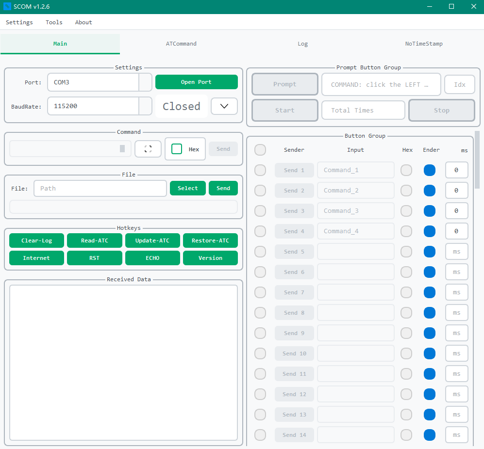

<div align="center">
  <h1>SCOM</h1>
  <p><i>An Open Source Serial Communication Tool for You</i></p>

  
  
  

</div>
<p align="center">
  <a href="#introduction">Introduction</a> •
  <a href="#system-requirements">System Requirements</a> •
  <a href="#installation">Installation</a> •
  <a href="#directory-structure">Directory Structure</a> •
  <a href="#quick-start">Quick Start</a> •
  <a href="#features">Features</a> •
  <a href="#user-manual">User Manual</a> •
  <a href="#customization--extension">Customization & Extension</a> •
  <a href="#contributing">Contributing</a>
</p>

---

**🌐 Language / 语言**

- [中文文档](./README.md)
- [English Documentation](./README_EN.md)

---

## Introduction



**SCOM - Serial Communication:**

SCOM is a powerful and easily extensible open-source serial communication tool designed for developers, test engineers, and hardware enthusiasts who need to interact with serial devices.

### 🚀 Project Highlights

- **Easy to Use**: Intuitive graphical interface, ready to use out of the box
- **Feature-Rich**: Support for multiple data formats, custom commands, batch operations, and more
- **Highly Extensible**: Modular architecture supporting secondary development and feature customization
- **Complete Logging**: Detailed communication log recording and analysis capabilities
- **Theme Support**: Multiple UI themes available with personalization options

Whether you're an embedded development engineer, IoT device debugger, or a beginner learning serial communication, SCOM provides you with a convenient and efficient serial communication solution.

## System Requirements

- **Operating System**: Windows 10/11
- **Python Version**: Python 3.6.1 and above (Python 3.8+ recommended)
- **Dependencies**:
  1. **PySide6**: For building the user interface
  2. **pyserial**: For serial communication functionality
  3. **requests**: For network requests and update checking
  4. **markdown**: For help documentation rendering
  5. **python-dotenv**: For environment variable management

## Installation

### Method 1: One-Click Installation (Recommended)

1. Download the project locally
2. Run `run as admin.bat` with administrator privileges. The script will automatically:
   - Check and install Python environment
   - Install required dependencies
   - Configure the runtime environment

### Method 2: Manual Installation

1. **Install Python**:
   - Download Python 3.8+ from [Python Official Website](https://www.python.org/downloads/)
   - Check "Add Python to PATH" during installation

2. **Get Source Code**:
   ```bash
   git clone https://github.com/ifishin/SCOM.git
   cd SCOM
   ```

3. **Install Dependencies**:
   ```bash
   pip install -r requirements.txt
   ```
   Or install individually:
   ```bash
   pip install pyside6 pyserial requests markdown python-dotenv
   ```

4. **Build Project** (Optional):
   ```bash
   python setup.py build
   ```

## Directory Structure

Here's the SCOM directory structure:

```plaintext
SCOM/
│
├── components/
│   └── [components_modules_here]
├── config/
│   └── [config_files_here]
├── docs/
│   └── [documentation_files_here]
├── examples/
│   └── [example_files_here]
├── logs/
│   └── [application_logs_here]
├── middleware/
│   └── [middleware_modules_here]
├── res/
│   └── [resource_files_here]
├── scripts/
│   └── [debug_script_files_here]
├── styles/
│   └── [style_files_here]
├── tests/
│   └── [test_scripts_here]
├── tmps/
│   └── [temporary_files_here]
├── utils/
│   └── [utility_modules_here]
├── .env
├── .gitignore
├── CHANGELOG.md
├── config.ini
├── favicon.ico
├── KNOWN_ISSUES.md
├── LICENSE
├── README.md
├── requirements.txt
├── ROADMAP.md
├── run as admin.bat
├── SCOM.spec
├── setup.py
└── Window.py
```

- **components**: Contains project component modules for implementing various functions, such as serial communication components
- **config**: Stores project configuration files for common settings like serial port parameter configurations
- **docs**: Contains project documentation files, such as user manuals and API documentation
- **examples**: Contains example files demonstrating how to use SCOM for serial communication
- **logs**: Stores application error log files for subsequent analysis and troubleshooting
- **middleware**: Contains middleware modules for handling data streams or other intermediate processing logic, such as data filtering or protocol conversion
- **res**: Contains project resource files, such as icons and images
- **scripts**: Stores debugging script files for auxiliary tools during development and testing
- **styles**: Stores interface style-related files, such as CSS or stylesheets
- **tests**: Contains test scripts for verifying project functionality and performance
- **tmps**: Temporary file directory for storing temporary data or intermediate files generated during runtime
- **utils**: Contains utility functions or modules, such as data conversion tools
- **.env**: Environment configuration file for storing sensitive information or environment variables
- **.gitignore**: Git ignore file specifying which files should not be version controlled
- **CHANGELOG.md**: Change log file recording project version updates and modification history
- **config.ini**: Configuration file storing common settings like default serial port parameters
- **favicon.ico**: Website icon file for browser tab display
- **KNOWN_ISSUES.md**: Known issues file listing current version defects and solutions
- **LICENSE**: License file defining the project's open source license terms
- **README.md**: Project description file providing project overview, installation, and usage guide
- **requirements.txt**: Dependency file listing required Python packages and their versions
- **ROADMAP.md**: Roadmap file describing future development plans and goals
- **run as admin.bat**: Windows batch file for running programs with administrator privileges, can check environment and install required components
- **SCOM.spec**: PyInstaller specification file for generating executable file configuration
- **setup.py**: Project installation and packaging script supporting installation via pip
- **Window.py**: Main program file containing the application's main window and core logic

## Quick Start

### Launch Application

```bash
# Navigate to project directory
cd SCOM

# Launch application
python Window.py
```

### Basic Usage Flow

1. **Connect Serial Device**: After launching the application, select serial port and baud rate from the top dropdown menu
2. **Send Data**: Enter data to send in the input box and click the send button
3. **Receive Data**: Data received from the serial port will be displayed in real-time on the main interface
4. **Save Logs**: All communication data is automatically saved to the `logs/` directory

## Features

- ✅ **Real-time Serial Communication**: Support for various baud rates and data formats
- ✅ **Data Format Support**: ASCII and HEX send/receive
- ✅ **Custom Commands**: Configurable shortcut buttons for common commands
- ✅ **Data Logging**: Complete communication log recording and viewing
- ✅ **Theme Styles**: Multiple UI themes available with custom style support
- ✅ **Batch Operations**: Support for batch command execution
- ✅ **Smart Parsing**: Automatic recognition of command and timestamp formats
- ✅ **Environment Configuration**: One-click environment configuration and dependency installation
- ✅ **High Extensibility**: Modular design, easy for secondary development

## User Manual

- **Help Documentation**: SCOM provides detailed operation manuals. You can find detailed instructions on how to use SCOM in [Help.md](./docs/Help.md)
- **Style Management**: View [Style Management Guide](./docs/STYLE_MANAGEMENT_GUIDE.md) to learn how to customize interface themes
- **Known Issues**: Please refer to [KNOWN_ISSUES.md](./KNOWN_ISSUES.md) when encountering problems

## Customization & Extension

### Secondary Development

SCOM adopts a modular design, allowing you to easily extend functionality:

1. **Add Custom Components**: Add new functional modules in the `components/` directory
2. **Custom Styles**: Modify QSS style files in the `styles/` directory
3. **Extend Protocol Support**: Add protocol parsers in the `middleware/` directory
4. **Add Tool Scripts**: Add auxiliary tools in the `scripts/` directory

### Development Environment Setup

```bash
# Clone project
git clone https://github.com/ifishin/SCOM.git
cd SCOM

# Install development dependencies
pip install -r requirements.txt

# Run tests
python -m pytest tests/

# Start development mode
python Window.py
```

## Contributing

We welcome any form of contribution!

### How to Contribute

1. **Fork** this repository
2. **Create** a feature branch: `git checkout -b feature/AmazingFeature`
3. **Commit** your changes: `git commit -m 'Add some AmazingFeature'`
4. **Push** to branch: `git push origin feature/AmazingFeature`
5. **Create** a Pull Request

### Contribution Types

- 🐛 **Bug Fixes**: Fix known issues
- ✨ **New Features**: Add new functionality
- 📝 **Documentation**: Improve documentation and comments
- 🎨 **Styling**: UI/UX improvements and style optimization
- ⚡ **Performance**: Performance optimization and code refactoring
- ✅ **Testing**: Add test cases

### Code Standards

- Follow PEP 8 Python coding standards
- Add corresponding test cases for new features
- Update relevant documentation
- Use clear descriptions for commit messages

## Contact

- **Project Repository**: [https://github.com/ifishin/SCOM](https://github.com/ifishin/SCOM)
- **Issue Feedback**: [GitHub Issues](https://github.com/ifishin/SCOM/issues)
- **Changelog**: View [CHANGELOG.md](./CHANGELOG.md)
- **Development Roadmap**: View [ROADMAP.md](./ROADMAP.md)

## License

This project is licensed under the [MIT License](./LICENSE) - see the LICENSE file for details.

---

<div align="center">

**If this project helps you, please consider giving it a ⭐**

Made with ❤️ by [iFishin](https://github.com/ifishin)

</div>
